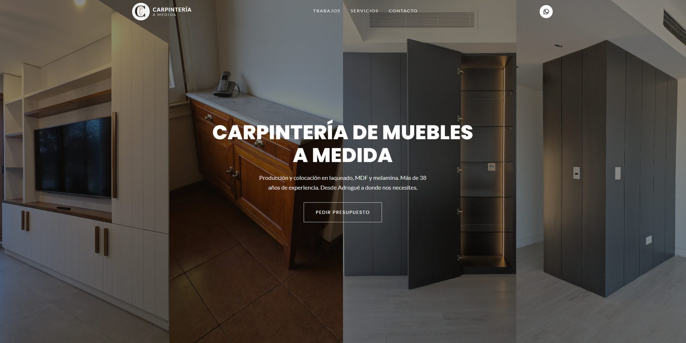
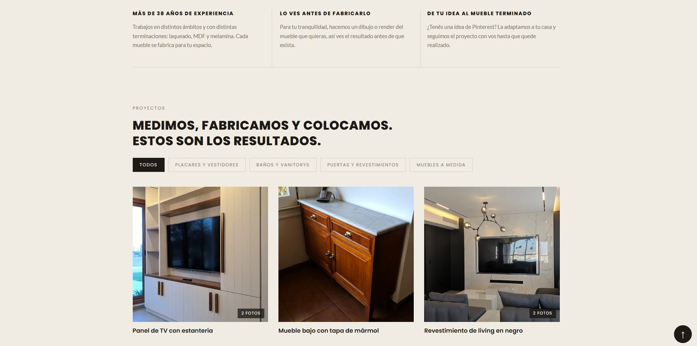
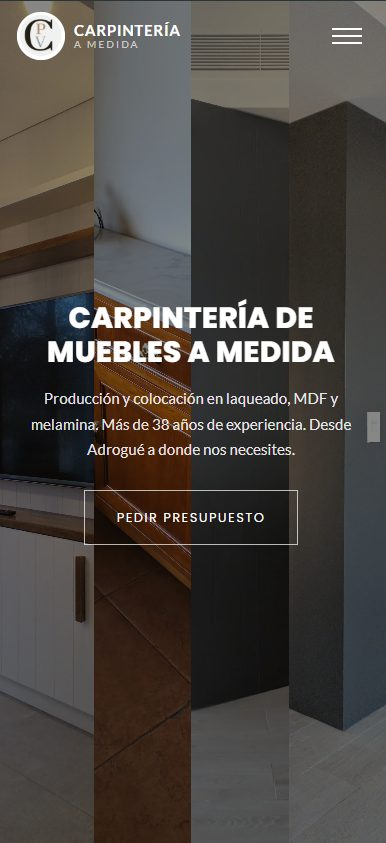
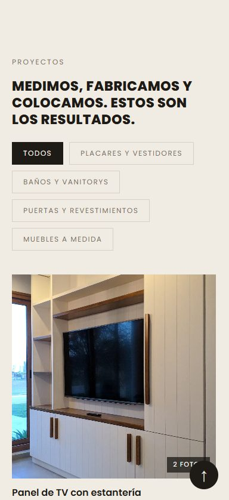

# Carpintería · Muebles a Medida

Sitio del portfolio de la carpintería: muebles a medida, producción y colocación.
Adrogué, Zona Sur — Buenos Aires.

Hecho con React + Vite.





### En el celular

<p align="left">
  
  
</p>

## Correr en local

```bash
npm install
npm run dev
```

Para verlo desde el celular (misma red WiFi):

```bash
npm run dev -- --host
```

y abrir la dirección que aparece como **Network**.

## Publicar

```bash
npm run build
```

Genera la carpeta `dist/`, que es lo que se sube al hosting (Netlify).

## Cómo se administran las fotos

Todo vive en `src/fotos.js`. Cada foto es un bloque:

```js
{
  id: 'AP1Gcz...',                    // id de la foto en Google Fotos
  titulo: 'Placard con cajonera',     // nombre del trabajo (en negro)
  detalle: 'Laqueado',                // material o terminación (en gris, opcional)
  categoria: 'placares',              // uno de los ids de CATEGORIAS
  proyecto: 'grupo-23',               // opcional: agrupa fotos del MISMO mueble
  portada: true,                      // opcional: esta foto encabeza el grupo
}
```

- **Agregar una foto**: sumar un bloque nuevo.
- **Sacarla**: borrar su bloque.
- **Agrupar varias fotos de un mismo mueble**: darles el mismo `proyecto`. Se
  muestran como una sola tarjeta y el resto se ven al abrirla.
- **Elegir cuál se ve en la tarjeta**: `portada: true` en esa foto.
- **Categorías**: se definen arriba del archivo, en `CATEGORIAS`. Los filtros de
  la galería se generan solos y solo aparecen los que tienen fotos.

Las imágenes se sirven desde el álbum compartido de Google Fotos, en WebP y en
varios tamaños según la pantalla (ver `img()`, `thumb()`, `full()`, `xl()` y
`srcSet()` al final de `fotos.js`).

> Pendiente: migrar las fotos a `src/assets/` para no depender de que el álbum
> siga compartido, y sumar un CMS para que se puedan cargar sin tocar código.

## Estructura

```
src/
  fotos.js                 datos de todos los trabajos
  components/
    Header.jsx             barra superior transparente
    Hero.jsx               portada con 4 columnas animadas
    Servicios.jsx          tres columnas de texto
    Galeria.jsx            grilla con filtros y visor de fotos
    Contacto.jsx           teléfono y botón de WhatsApp
    Footer.jsx             navegación, zona y redes
  hooks/useInView.js       detecta cuando un elemento entra en pantalla
public/                    favicons
clasificar-fotos.html      herramienta local para nombrar y clasificar fotos
```

## Herramienta de clasificación

`clasificar-fotos.html` se abre con doble clic (no necesita el servidor). Muestra
todas las fotos numeradas con campos para título, material, categoría y
agrupación, y genera el bloque de código listo para pegar en `fotos.js`.
